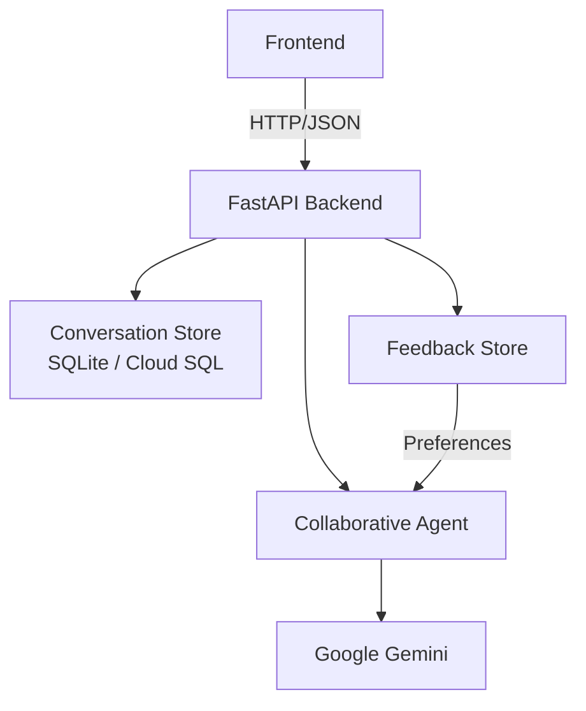

# Collaborative Partner — Backend

> A Collaborative AI Partner that works alongside users: asking clarifying questions, guiding progressively, and adapting in real time based on explicit feedback.

Built for the **Collaborative Partner** hackathon track using **FastAPI**, **Google Gemini**, and **SQLAlchemy**.

---

## Architecture



---

## Features

| Feature | Description |
|---|---|
| **Conversational collaboration** | Multi-turn conversation with full message history |
| **Clarifying questions** | Agent asks questions before making assumptions |
| **Conversation memory** | Full history passed to the agent on every turn |
| **Feedback collection** | Users rate agent responses (1–5) with free-text comments |
| **Adaptive responses** | Agent adapts behavior based on extracted preferences |
| **Preference tracking** | Preferences persisted per-conversation, influence every reply |
| **Mock mode** | Run fully offline without a Gemini API key |
| **REST API** | Clean versioned API (`/api/v1/`) with OpenAPI docs |

---

## Project Structure

```
backend/
├── app/
│   ├── main.py                    # FastAPI app, lifespan, CORS, routers
│   ├── api/routes/
│   │   ├── health.py              # GET /health
│   │   ├── conversations.py       # POST/GET/DELETE /api/v1/conversations
│   │   ├── chat.py                # POST /api/v1/chat
│   │   └── feedback.py            # POST /api/v1/feedback
│   ├── agents/
│   │   ├── collaborative_agent.py # Abstract AgentService + Gemini + Mock
│   │   └── prompts.py             # System prompt + preference extraction
│   ├── core/
│   │   ├── config.py              # Pydantic Settings (all env vars)
│   │   └── logging.py             # Structured logging setup
│   ├── db/
│   │   ├── database.py            # Engine, session, Base, get_db()
│   │   ├── models.py              # ORM models
│   │   └── repositories/          # Data-access layer
│   ├── schemas/                   # Pydantic request/response models
│   └── services/                  # Business logic layer
├── tests/
│   ├── conftest.py                # Fixtures: in-memory DB, mock agent, TestClient
│   ├── test_health.py
│   ├── test_conversations.py
│   ├── test_chat.py
│   └── test_feedback.py           # Includes full integration test
├── .env.example
├── .gitignore
├── pytest.ini
├── requirements.txt
├── Dockerfile
└── README.md
```

---

## Quick Start

### 1. Clone and enter the backend directory

```bash
cd backend
```

### 2. Create a virtual environment

```bash
python -m venv .venv
# Windows
.venv\Scripts\activate
# macOS/Linux
source .venv/bin/activate
```

### 3. Install dependencies

```bash
pip install -r requirements.txt
```

### 4. Configure environment

```bash
cp .env.example .env
```

Edit `.env`:

```env
# For mock mode (no API key needed):
AGENT_MODE=mock

# For real Gemini responses:
AGENT_MODE=gemini
GOOGLE_API_KEY=your_key_here
GEMINI_MODEL=gemini-2.0-flash
```

### 5. Run locally

```bash
uvicorn app.main:app --reload
```

The API will be available at `http://localhost:8000`.

---

## API Documentation

Interactive Swagger UI is available at:

```
http://localhost:8000/docs
```

ReDoc is available at:

```
http://localhost:8000/redoc
```

---

## API Reference

### Health Check

```http
GET /health
```

### Create Conversation

```http
POST /api/v1/conversations
Content-Type: application/json

{"user_id": "demo-user"}
```

### Send a Message

```http
POST /api/v1/chat
Content-Type: application/json

{
  "conversation_id": "<uuid>",
  "message": "I want to prepare for a software engineering interview."
}
```

### Get Conversation History

```http
GET /api/v1/conversations/<conversation_id>
```

### Submit Feedback

```http
POST /api/v1/feedback
Content-Type: application/json

{
  "conversation_id": "<uuid>",
  "message_id": "<uuid>",
  "rating": 4,
  "feedback_text": "I prefer practical coding examples rather than theory."
}
```

### Delete Conversation

```http
DELETE /api/v1/conversations/<conversation_id>
```

---

## Demo Scenario

The backend supports this full demo flow via the API:

1. **Create conversation** → `POST /api/v1/conversations`
2. **User:** "I want to prepare for a software engineering interview."
3. **Agent:** "What role are you targeting, how much experience do you have, and when is the interview?"
4. **User answers** → Agent generates personalized preparation plan.
5. **Feedback:** "I prefer practical coding examples rather than theory." → Preferences extracted and stored.
6. **User:** "What algorithms should I review?" → Agent response now prioritizes practical coding examples.

---

## Agent Mode

| Mode | Description |
|---|---|
| `mock` | Deterministic cycling responses, no API key needed. Perfect for development and CI. |
| `gemini` | Real Google Gemini API calls. Requires `GOOGLE_API_KEY`. |

Set via:

```env
AGENT_MODE=mock   # or gemini
```

---

## How Adaptation Works

When a user submits feedback, the backend:

1. Stores the raw feedback in the `feedback` table.
2. Runs keyword analysis on the feedback text.
3. Extracts structured preferences (e.g. `example_preference`, `response_style`).
4. Upserts them into the `user_preferences` table.
5. On the **next chat request**, preferences are loaded and injected into the agent's system prompt.
6. The agent explicitly adapts its response based on those preferences.

No machine learning required — simple, demonstrable, and reliable for the MVP.

---

## Testing

```bash
pytest
```

Tests use an **in-memory SQLite database** and a **mock agent** — no real API key needed.

To run with verbose output:

```bash
pytest -v
```

---

## Docker

### Build the image

```bash
docker build -t collaborative-partner-backend .
```

### Run locally

```bash
docker run -p 8080:8080 \
  -e AGENT_MODE=mock \
  -e DATABASE_URL=sqlite:///./app.db \
  collaborative-partner-backend
```

To use Gemini:

```bash
docker run -p 8080:8080 \
  -e AGENT_MODE=gemini \
  -e GOOGLE_API_KEY=your_key_here \
  -e GEMINI_MODEL=gemini-2.0-flash \
  -e DATABASE_URL=sqlite:///./app.db \
  collaborative-partner-backend
```

---

## Future Deployment (Google Cloud Run)

The backend is designed to be deployable to **Google Cloud Run** without major changes:

- Listens on `0.0.0.0:${PORT}` (Cloud Run requirement ✓)
- All configuration via environment variables ✓
- SQLite can be replaced by **Cloud SQL** or **Firestore** by updating `DATABASE_URL` and the SQLAlchemy engine ✓
- `Dockerfile` is production-ready ✓

Deployment command (future):

```bash
gcloud run deploy collaborative-partner \
  --source . \
  --region us-central1 \
  --set-env-vars AGENT_MODE=gemini,GOOGLE_API_KEY=...,GEMINI_MODEL=gemini-2.0-flash
```

---

## Environment Variables Reference

| Variable | Default | Description |
|---|---|---|
| `GOOGLE_API_KEY` | *(empty)* | Google Gemini API key |
| `GEMINI_MODEL` | `gemini-2.0-flash` | Gemini model identifier |
| `AGENT_MODE` | `mock` | `mock` or `gemini` |
| `DATABASE_URL` | `sqlite:///./app.db` | SQLAlchemy database URL |
| `CORS_ORIGINS` | `http://localhost:3000,...` | Comma-separated allowed origins |
| `DEBUG` | `false` | Enable verbose logging |
| `MAX_MESSAGE_LENGTH` | `4000` | Max characters per message |
